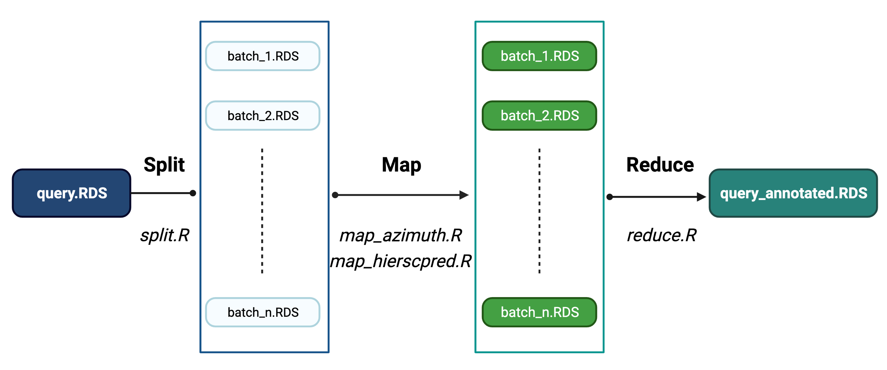

# Getting started

## Downloading singularity image

All core scripts and data necessary to perform cell-type classification are 
available in a singularity container from Dropbox:

https://www.dropbox.com/sh/ekvdocei8r45jxq/AACA17z7PFNbVkeuSavFvjPNa?dl=0


## Cell type classification workflow

The algorithm to perform cell type classification follows a split-map-reduce approach.
If multiple experimental units are contained in the same Seurat object (e.g. pool, batch,
dataset), the data is first split into multiple objects. Cell type classification 
is performed individually in each batch and finally results are aggregated into a
single Seurat object. The figure below shows a general description of the process:


{width=100%}

The description of each R script included in the previous figure is included in the
next section.

## Singularity image components

The singularity image `cell_classification.sif` contains the following scripts:

- `split_object.R`: Splits a `Seurat` data object into multiple objects according to
the levels in a column from the metadata,
- `azimuth.R`: Performs cell type classification using the azimuth approach
- `hier_scpred.R`: Applied hierarchical `scPred` to classify cells 
- `reduce.R`: If the initial data was split, this script aggregates all
results into a single Seurat object
- `compare_results.R`: If both azimuth and hierarchical scPred were run, this 
script creates a heatmap and a long-format contingency matrix containing the
classification concordance between the two methods.


All previous scripts share the following parameters:

- `--file`: Input RDS object or directory
- `--out`: Base filename for output files
- `--path`: Output directory to store results. If not specified, the
current directory will be used to store the output(s)


The image contains the following reference files:

- `pbmc_multimodal.h5seurat`: used for azimuth classification
- `hier_scpred.RDS`: hierarchical trained model for scPred classification

To call components within the container, we commonly use the following syntax


```bash
# do not run
singularity exec cell_classification.sif [COMMAND]
```

However, to make make a given directory visible to the container, we have to use
the `-B` flag


```bash
# do not run
singularity exec -B $PWD cell_classification.sif [COMMAND]
```

The previous command will allow the current directory to be visible.

If multiple paths are needed to be visible (e.g. input and output directories 
not contained in the currect directory), please see 

https://sylabs.io/guides/3.0/user-guide/bind_paths_and_mounts.html


