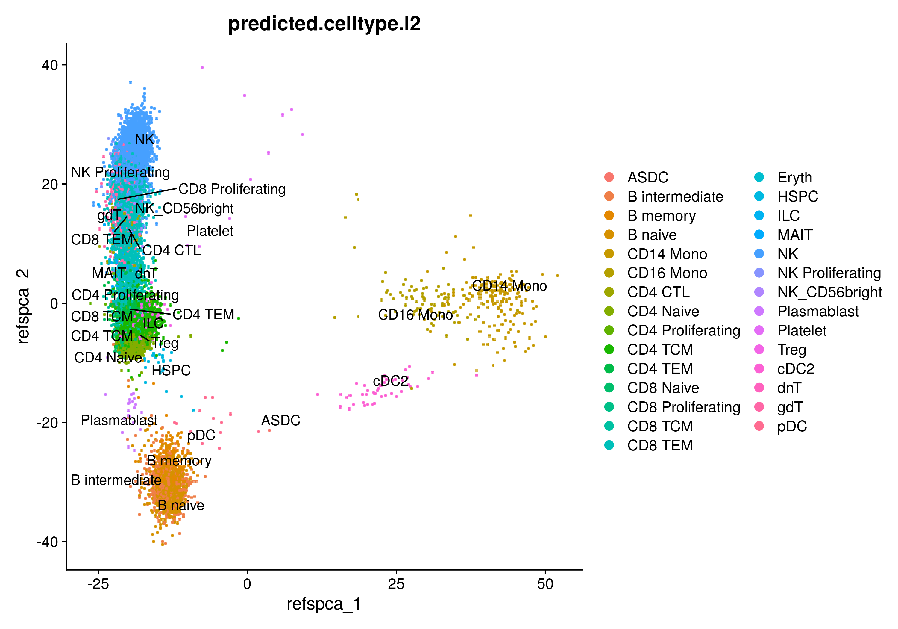

# Azimuth classification

Cell type classification using the **azimuth** method can be performed using
`map_azimuth.R`.

Let's create an output directory to store the results.


```bash
mkdir step2_azimuth
```

And check the input arguments


```bash
singularity exec -B $PWD cell_classification.sif \ 
  Rscript /map_azimuth.R --help
```


```
Usage: map_azimuth.R [options]


Options:
        --file=CHARACTER
                RDS object file name

        --batch=CHARACTER
                Batch column. If provided, each group in from the batch columns is mapped to reference independently

        --plan=CHARACTER
                Strategy to resolve future [default= sequential]:
                multisession
                multicore
                cluster
                remote
                transparent

        --workers=NUMERIC
                Number of workers used for parallelization
                [default= 1]

        --mem=NUMERIC
                Maximum allowed total size (in GB) of global variables identified
                [default= Inf]

        --out=CHARACTER
                Output file name [default= azimuth]

        --path=CHARACTER
                Output path to store results [default= .]

        -h, --help
                Show this help message and exit
```

Further data splitting and classification can be performed within `map_azimuth.R` 
via the `future` package, however, we'll classify cells for each of the partitions 
we already created. 


We can classify each batch within a loop using `map_azimuth.R` as follows:


```bash
for i in $(ls step1_split);
do
  out=$(echo $i | awk 'gsub(".RDS", "")') # Use same base filename as output
  singularity run -B $PWD cell_classification.sif \ 
  Rscript /mapazimuth.R \
  --file step1_split/${i} \
  --path step2_azimuth \
  --out ${out}
done
```

In this example, the output is stored in `step2_azimuth` including each 
Seurat object containing:

-   Cell type classification (`predicted.celltype.l2`) + prediction scores
    (`predicted.celltype.l2.scores`) stored in the metadata

-   Reference-based reductions:

    -   azimuth_spca: Supervised PCA
    -   azimuth_umap: UMAP generated using the WNN graph
    
-   A new assay called `predicted_ADT` containing imputed protein data based on
RNA

Additionally, plots for the `azimuth_spca` and `azimuth_umap` reductions are included
as outputs for exploratory data analysis.

{width=100%}

{width=100%}

## Parallelize classification: SGE example

The following array job code in SGE (Sun Grid Engine) can be used as a guide to 
classify each pool in individual jobs. This code snippet was used to
classify multiple Seurat objects (75 pools) from the OneK1K dataset. 


```bash
#$ -N clasify_cells
#$ -q short.q
#$ -l mem_requested=50G
#$ -S /bin/bash
#$ -r yes
#$ -cwd 
#$ -o results/2021-10-28_cell_type_annotation
#$ -e results/2021-10-28_cell_type_annotation

# mkdir results/2021-10-28_cell_type_annotation

cd $SGE_O_WORKDIR

# Set environmental variables
input=results/2021-10-28_pools
output=results/2021-10-28_cell_type_annotation

# Get job info
echo "JOB: $JOB_ID TASK: $SGE_TASK_ID HOSTNAME: $HOSTNAME"

# Get basefile name
files=($(ls ${input} | grep ".RDS"))
i="$(($SGE_TASK_ID-1))"

filename=${files[$i]}
filename=$(echo $filename | sed 's/.RDS//')

echo "Classifying: $filename"

# Run main command
singularity exec -B $SGE_O_WORKDIR bin/cell_classification.sif \
  Rscript /map_azimuth.R \
  --file ${input}/${filename}.RDS \
  --out ${filename}_out \
  --path ${output}
```

If we save the previous code into a file (e.g. `run_azimuth.R`), we can launch 
an array job iterating for each pool name


```bash
qsub -t 1-75 bin/run_azimuth.sh
# -t Vector of length equal to the number of pools (.RDS files)
```

